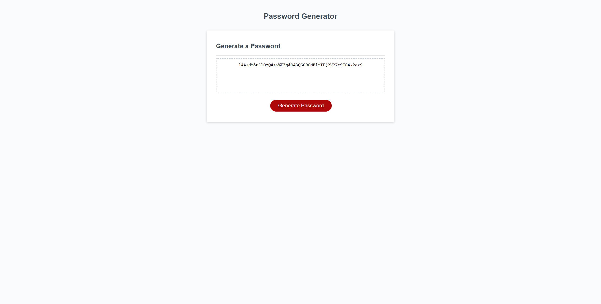

# password-generator

## Homework 03
This project was built for homework 3 of the UW fullstack coding bootcamp. It's a password generator that creates a customizable random password by allowing the user the choose how long the password is and what kinds of characters they'd like to include in it. Clicking the "Generate password" button will walk the use through a series of prompts to determine the make-up of the password. It also comes with built-in error prevention to guide the user to successfully making their unique password.

Link: https://brooks-t.github.io/password-generator/

